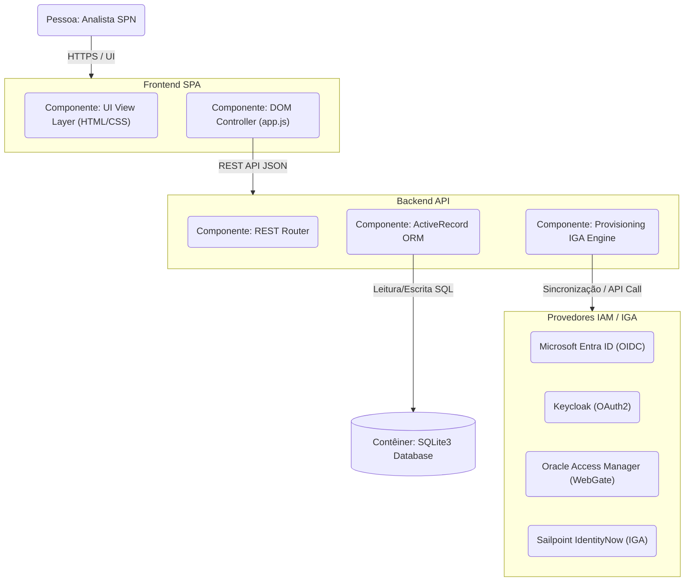
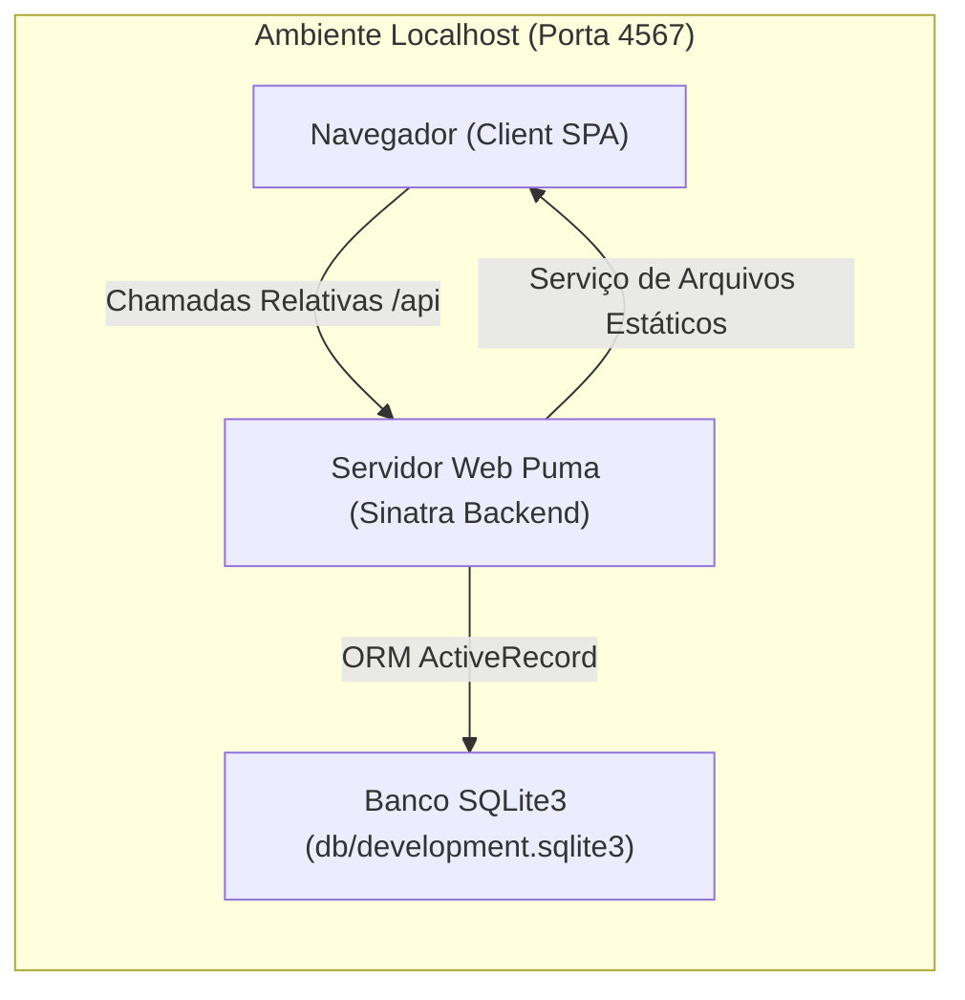
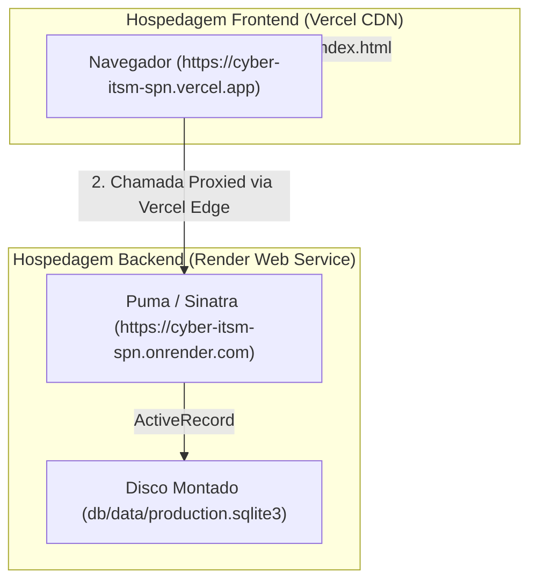

# Documentação Oficial / Official Documentation - CyberITSM SPN

Este documento detalha as especificações técnicas, arquitetura multicamadas, controle de autenticação e governança, integrações com microsserviços de IAM e o roteiro de próximos passos do sistema **CyberITSM SPN** rebuild em Ruby.

---

## 🇧🇷 Português - Especificação Técnica

### 1. Visão Geral do Sistema
O **CyberITSM SPN** é uma plataforma corporativa de gerenciamento de chamados especializada em **Arquitetura e Conformidade de Cibersegurança**. Ela implementa um fluxo visual Kanban inspirado no Jira da Atlassian, permitindo que analistas correlacionem cada ticket com controles regulatórios internacionais (NIST CSF, CIS Controls, ISO/IEC 27001 e SABSA) de forma auditável e segura.

### 2. Arquitetura Multicamadas (Detailed C4 Containers & Components)
A solução adota um design limpo e estruturado em camadas no frontend e backend para garantir separação de preocupações e robustez operacional:



#### A. Camada de Frontend (SPA)
- **UI View Layer (HTML5 / CSS3)**: Utiliza a marca oficial **Telefônica Mistica** (cores roxas `#660099`, laranja Vivo `#FF9900` e tipografia Outfit do Google Fonts) para renderizar a tela de login, o Kanban de segurança, gerenciador de status e os formulários de acesso.
- **DOM Controller (JavaScript - app.js)**: Controla o estado em tempo de execução no cliente, gerencia a lógica de drag-and-drop de chamados SPN e manipula requisições assíncronas assinaladas via Fetch API.

#### B. Camada de Backend (Sinatra Microservice)
- **REST Router & Controllers**: Roteamento leve em Ruby Sinatra. Expõe APIs estruturadas (`/api/tickets`, `/api/statuses`, `/api/iam`, `/api/auth/*`). É responsável por injetar cabeçalhos rígidos de segurança HTTP (CSP, X-Frame-Options: DENY, X-Content-Type-Options: nosniff).
- **ActiveRecord ORM (Modelos & Validações)**: Traduz o esquema do banco de dados em classes e relacionamentos Ruby (`Status`, `Ticket`, `Comment`, `AuditLog`, `IamProvider`, `IamUser`, `IdentityRequest`). Valida regras de negócio corporativas (ex: transição segura ao deletar status, movendo os chamados em transação de banco de dados para evitar inconsistência de registros).
- **IGA Provisioning Engine**: Processador de conectores e conformidades IAM. Executa simulações de sincronização e fluxos formais de governança IGA (Approval Workflows).

#### C. Camada de Banco de Dados (SQLite3)
- Banco de dados relacional encapsulado em arquivo físico local. Implementa chaves estrangeiras rígidas (`FOREIGN KEY`) para integridade referencial.

---

### 3. Autenticação, MFA & Jornada de Identidade
O CyberITSM SPN possui uma jornada completa de autenticação local e segurança baseada na tabela `iam_users`:
- **Login & Credenciais**: Usuários autenticam-se com e-mail corporativo e senha criptografada (via hash seguro `BCrypt`).
- **Autenticação Multi-Fator (MFA/TOTP)**: Utiliza a biblioteca `rotp` (compatível com Google Authenticator e Microsoft Authenticator). Usuários podem habilitar/desabilitar MFA em suas configurações, gerando uma chave secreta e exibindo um QR Code simulado para escaneamento móvel.
- **Esqueci minha senha & Recuperação**: O fluxo gera um token único de redefinição de senha (`reset_token`) com expiração de 1 hora. Como estamos em um ambiente sandbox simulado, a aplicação exibe um banner dinâmico com o link de redefinição contendo o token para fácil teste e homologação.
- **Alteração de Senha**: O painel de segurança logado permite alterar a senha atual de forma segura validando a assinatura anterior.

---

### 4. Integração com Microsserviços IAM / IGA
O CyberITSM SPN possui adaptadores nativos para gerenciar identidades a partir de quatro grandes provedores de mercado:
- **Microsoft Entra ID**: Conector simulado que importa identidades com base em escopos OIDC e grupos corporativos.
- **Keycloak Broker**: Conector OIDC que mapeia Realms e simula credenciais de Client ID/Client Secret em servidores centralizados.
- **Oracle Access Manager (OAM)**: Integração via emulação de injeção de cabeçalhos de rede HTTP baseada em Gateways legados (WebGate Remote User).
- **Sailpoint IdentityNow (IGA)**: Módulo de governança formal que exige criação de requisição (Identity Request), workflow de aprovação por gestor SecOps e provisionamento local automático pós-autorização.
- **Criação Manual (Local)**: Rota direta (`POST /api/iam/users`) que permite o cadastro de colaboradores locais diretamente no banco de dados com senha e perfil RBAC específico.

---

### 5. Suite de Testes & Segurança (SecOps / SPN)
- **RSpec e Rack::Test**: Executa 17 testes funcionais que cobrem o Kanban, a integridade da remoção de status, login de usuários, redefinição por token, ativação de MFA e fluxos do Sailpoint.
- **SCA**: `bundler-audit` analisa a árvore de dependências do Gemfile em busca de vulnerabilidades CVE ativas.
- **SAST**: `brakeman` e `rubocop` avaliam a qualidade e segurança do código estático contra falhas de injeção e desvios de sintaxe.
- **DAST**: O script `scripts/security_scan.rb` sobe a aplicação localmente e testa injeções de parâmetros e valida a correta resposta dos cabeçalhos HTTP OWASP.

---

### 6. Roteiro de Próximos Passos (Enterprise Roadmap)
Para elevar a aplicação ao nível enterprise em produção, as seguintes etapas devem ser seguidas:
1. **Conteinerização Completa (Docker/Compose)**: Escrever o `Dockerfile` para o serviço Sinatra e orquestrar múltiplos ambientes (Staging/Production) com `docker-compose.yml` integrando o banco de dados.
2. **Migração para PostgreSQL**: Substituir o driver de SQLite3 por PostgreSQL no arquivo `database.yml` para suportar alta concorrência de acessos, pool de conexões robusto e failover automático.
3. **Integração OAuth2/OIDC Real**: Substituir os dados simulados por fluxos reais de redirecionamento OIDC (authorization code flow) utilizando bibliotecas como `omniauth` e mapeando claims de perfil diretamente no Microsoft Entra ID e Keycloak produtivos.
4. **Criptografia e Logs Imutáveis com Assinatura**: Adicionar criptografia de chaves assimétricas para assinar digitalmente cada alteração em `audit_logs` no banco de dados, tornando as trilhas infalsificáveis.
5. **Secret Management (Vault)**: Remover as credenciais e senhas de conectores IAM da base de dados e consumi-las em tempo de execução via cofre de chaves (ex: HashiCorp Vault).

---

## 🇺🇸 English - Technical Specification

### 1. System Overview
**CyberITSM SPN** is an enterprise ticket management platform specialized in **Cybersecurity Architecture and Compliance**. It implements an Atlassian Jira-inspired visual Kanban board workflow, allowing architects and SecOps analysts to correlate every action with international compliance standards (NIST CSF, CIS Controls, ISO/IEC 27001, and SABSA) in an auditable and secure environment.

### 2. Multi-Layer Architecture (Detailed C4 Containers & Components)
The application adopts a clean, layered design in both frontend and backend to guarantee strict separation of concerns and operational durability:

#### A. Frontend Layer (SPA)
- **UI View Layer (HTML5 / CSS3)**: Employs **Telefonica's Mistica** design system tokens (Vivo purple palette `#660099`, orange warning color `#FF9900`, and Google Fonts Outfit typography) to render the login overlay card, Kanban board, and IAM forms.
- **DOM Controller (JavaScript - app.js)**: Manages in-browser state, handles drag-and-drop operations on SPN cards, and performs asynchronous Fetch API requests to update views in real-time.

#### B. Backend Layer (Sinatra Microservice)
- **REST Router & Controllers**: Sinatra REST endpoints (`/api/tickets`, `/api/statuses`, `/api/iam`, `/api/auth/*`) responsible for mapping payloads and injecting OWASP HTTP protection headers (CSP, X-Frame-Options: DENY, X-Content-Type-Options: nosniff).
- **ActiveRecord ORM (Models & Validations)**: Maps database schemas to object representations (`Status`, `Ticket`, `Comment`, `AuditLog`, `IamProvider`, `IamUser`, `IdentityRequest`). Applies business constraints such as dynamic column reordering and secure ticket transfer transactions during status deletion.
- **IGA Provisioning Engine**: Processes synchronizations and authorization workflows (simulating target connector updates).

#### C. Database Container (SQLite3)
- Embedded SQL file persisting tables with strict foreign key constraints to enforce database referential integrity.

---

### 3. Authentication, MFA & Identity Journey
The CyberITSM SPN implements a full security authentication flow on top of `iam_users` records:
- **Login & Credentials**: Users authenticate using their corporate email and secure hashed passwords (managed via `BCrypt`).
- **Multi-Factor Authentication (MFA/TOTP)**: Powered by `rotp` gem (compatible with Google Authenticator). Users can toggle MFA on their settings panel, generating a unique base32 secret and displaying a mock QR Code for scan setup.
- **Forgot Password Recovery**: Generates a unique secure `reset_token` valid for 1 hour. In our simulated sandbox mode, the web interface prints a recovery link containing the token to easily allow testing.
- **Password Change**: Authenticated users can modify their passwords in real-time after verifying their current signature.

---

### 4. Identity & Access Governance Integrations (IAM / IGA)
The system exposes modular adapters mimicking four market-leading identity providers:
- **Microsoft Entra ID**: Cloud OIDC client simulating identity imports based on scopes and claims.
- **Keycloak Broker**: OIDC Realm mapping client credentials and local RBAC translations.
- **Oracle Access Manager (OAM)**: WebGate emulation extracting identity properties from gateway HTTP headers.
- **Sailpoint IdentityNow (IGA)**: Triggers access requests, records approval workflows by SecOps managers, and provisions identities locally upon authorization.
- **Manual Provisioning**: Exposes a REST API (`POST /api/iam/users`) allowing administrators to manually register and assign RBAC profiles with custom passwords.

---

### 5. Automated Security Pipeline (SecOps / SPN)
- **RSpec & Rack::Test**: Features 19 functional integration test cases validating Kanban board behavior, safe status cascades, logins, MFA checks, recovery tokens, audit logging, and RBAC rules.
- **SCA**: `bundler-audit` scans gem dependencies for known security advisories (CVEs).
- **SAST**: `brakeman` and `rubocop` perform static analysis on source code to identify code injection risks and syntactical formatting issues.
- **DAST**: `scripts/security_scan.rb` boots a test Puma server and dynamically verifies HTTP response security headers and SQL Injection parameter sanitization.

---

### 6. Guia de Migração Enterprise / Enterprise Migration Guide

Para transicionar a aplicação de um ambiente sandbox simulado para uma infraestrutura produtiva corporativa integrada, o seguinte roteiro com guias técnicos deve ser seguido:

#### A. Migração do Banco de Dados para PostgreSQL
O SQLite3 deve ser substituído pelo PostgreSQL para suportar concorrência, alta disponibilidade e backups automatizados.
1. Adicione a gem do PostgreSQL no `Gemfile`:
   ```ruby
   gem 'pg'
   ```
2. Atualize o `config/database.yml`:
   ```yaml
   production:
     adapter: postgresql
     encoding: unicode
     database: <%= ENV['DATABASE_URL'] %>
     pool: <%= ENV.fetch("RAILS_MAX_THREADS") { 15 } %>
     timeout: 5000
   ```
3. Execute o comando de migração nos servidores de release da esteira CI/CD.

#### B. Conteinerização com Docker (Dockerfile & Compose)
Para deploy em Kubernetes corporativo ou serviços gerenciados (como AWS ECS ou Google Cloud Run), crie o `Dockerfile` na raiz:
```dockerfile
# Dockerfile
FROM ruby:3.3.0-slim

RUN apt-get update -qq && apt-get install -y build-essential libpq-dev nodejs

WORKDIR /app
COPY Gemfile Gemfile.lock ./
RUN bundle install --without development test

COPY . .

EXPOSE 4567
CMD ["bundle", "exec", "ruby", "app.rb", "-p", "4567", "-o", "0.0.0.0"]
```

E crie o `docker-compose.yml` para orquestração local/homologação:
```yaml
version: '3.8'
services:
  db:
    image: postgres:15-alpine
    environment:
      POSTGRES_DB: cyber_itsm_prod
      POSTGRES_PASSWORD: StrongPasswordSecOps123
    volumes:
      - pgdata:/var/lib/postgresql/data
  web:
    build: .
    command: bundle exec rake db:migrate && bundle exec ruby app.rb -p 4567 -o 0.0.0.0
    ports:
      - "4567:4567"
    environment:
      - DATABASE_URL=postgres://postgres:StrongPasswordSecOps123@db:5432/cyber_itsm_prod
      - RACK_ENV=production
    depends_on:
      - db
volumes:
  pgdata:
```

#### C. Fluxo de Autenticação Real OIDC/OAuth2 (Microsoft Entra ID / Keycloak)
Para eliminar os usuários mock, substitua o fluxo de login manual pelas gems do OmniAuth.
1. Instale as dependências:
   ```ruby
   gem 'omniauth'
   gem 'omniauth-oauth2'
   gem 'omniauth-openid-connect'
   ```
2. Configure o middleware de autenticação em `app.rb`:
   ```ruby
   use OmniAuth::Builder do
     provider :openid_connect,
       name: :openid_connect,
       scope: [:openid, :profile, :email],
       response_type: :code,
       client_options: {
         port: 443,
         scheme: "https",
         host: "login.microsoftonline.com",
         authorization_endpoint: "/{tenant_id}/oauth2/v2.0/authorize",
         token_endpoint: "/{tenant_id}/oauth2/v2.0/token",
         userinfo_endpoint: "/{tenant_id}/openid/v2.0/userinfo",
         jwks_uri: "/{tenant_id}/discovery/v2.0/keys"
       },
       client_id: ENV['ENTRA_CLIENT_ID'],
       client_secret: ENV['ENTRA_CLIENT_SECRET']
   end
   ```

#### D. Gerenciamento Seguro de Segredos (HashiCorp Vault)
Remova qualquer credencial em formato de texto simples do banco de dados e utilize injeção de variáveis de ambiente dinâmicas via Secrets Manager corporativo (ex: AWS Secrets Manager ou HashiCorp Vault).
1. Configure o client no backend Ruby:
   ```ruby
   require 'vault'
   Vault.configure do |config|
     config.address = ENV['VAULT_ADDR']
     config.token = ENV['VAULT_TOKEN']
   end
   
   # Leitura de segredo na inicialização
   db_secret = Vault.logical.read("secret/data/database")
   ENV['DATABASE_URL'] = db_secret.data[:data][:url]
   ```

---

## 7. Arquitetura de Implantação Híbrida (Localhost vs. Produção Vercel + Render)

### 🇧🇷 Português - Detalhes da Implantação

#### A. Ambiente Localhost (Desenvolvimento)
No ambiente local, todos os componentes são executados na máquina do desenvolvedor de forma unificada. O servidor Ruby Sinatra (utilizando o servidor web Puma) serve tanto as APIs REST no endpoint `/api/*` quanto os ativos estáticos (HTML, CSS, JS) na pasta `/public`. A persistência é mantida em um arquivo SQLite local (`db/development.sqlite3`).



#### B. Ambiente de Produção Híbrido (Vercel + Render)
Em produção, a arquitetura é dividida em dois provedores diferentes (modelo híbrido) para maximizar o desempenho e resiliência:
1. **Frontend SPA (Hospedado na Vercel)**:
   - Os arquivos estáticos da pasta `public/` são compilados e distribuídos de forma estática através da CDN da Vercel.
   - O cliente roda no domínio `https://cyber-itsm-spn.vercel.app`.
2. **Backend API (Hospedado na Render)**:
   - O microsserviço Ruby Sinatra é executado em um Web Service Linux no Render.
   - O backend roda no domínio `https://cyber-itsm-spn.onrender.com`.
   - A persistência utiliza um disco de armazenamento persistente montado no contêiner em `/opt/render/project/src/db/data` mapeado no banco SQLite3 `db/data/production.sqlite3` (o que previne a ocultação acidental da pasta de migrações `db/migrate`).



#### C. Integração e Segurança Híbrida
- **CORS e OPTIONS Preflight**: Como as chamadas saem de um domínio da Vercel (`vercel.app`) para a Render (`onrender.com`), o navegador exige cabeçalhos CORS. O backend Sinatra foi atualizado para validar a origem da chamada e responder cabeçalhos `Access-Control-Allow-Origin` dinamicamente correspondendo à origem autorizada.
- **Autorização e Cookies de Sessão (Credentials)**: Para manter sessões seguras cross-domain, as requisições AJAX configuram `credentials: 'include'`. O backend autoriza explicitamente com `Access-Control-Allow-Origin` dinâmico e `Access-Control-Allow-Credentials: true`.
- **Roteamento e Proxy na Edge (`vercel.json`)**: Em vez de expor URLs externas no cliente, a Vercel atua como proxy reverso, encaminhando `/api/*` transparentemente para a Render. Isso mantém a mesma origem lógica aos olhos do navegador, preservando e enviando cookies de sessão de forma nativa e segura.

---

### 🇺🇸 English - Deployment Architecture

#### A. Localhost Environment (Development)
Under the local development setup, the entire platform runs on the developer's station. The Ruby Sinatra application (powered by the Puma web server) serves both static client assets (`/public`) and REST APIs (`/api/*`) on port `4567`. A local SQLite file (`db/development.sqlite3`) acts as the datastore.

#### B. Production Hybrid Deployment (Vercel + Render)
For production environments, the platform transitions to a multi-cloud hybrid architecture:
1. **Frontend SPA (Vercel CDN)**:
   - Public assets inside `public/` are served and distributed globally via Vercel's Edge network under the domain `https://cyber-itsm-spn.vercel.app`.
2. **Backend API Microservice (Render Web Service)**:
   - The Sinatra backend is deployed as a managed service on Render under the domain `https://cyber-itsm-spn.onrender.com`.
   - Persistence is achieved through a SQLite3 database (`db/data/production.sqlite3`) mounted on a persistent block storage volume at `/opt/render/project/src/db/data` (preventing conflicts with standard migration directories).

#### C. Connectivity & Cross-Origin Security
- **CORS Preflight (OPTIONS)**: To resolve cross-origin calls between Vercel and Render domains, the Sinatra server validates requesting origins (echoing matching ones) and responds to HTTP `OPTIONS` preflight requests.
- **Session Credentials**: Session cookies are transmitted securely. Client requests invoke `credentials: 'include'` and the server returns `Access-Control-Allow-Credentials: true`.
- **Edge Reverse Proxying (`vercel.json`)**: Vercel acts as a reverse proxy matching `/api/*` paths and proxying them to Render. This keeps requests same-domain in the browser, safeguarding session cookies and eliminating CORS issues.
