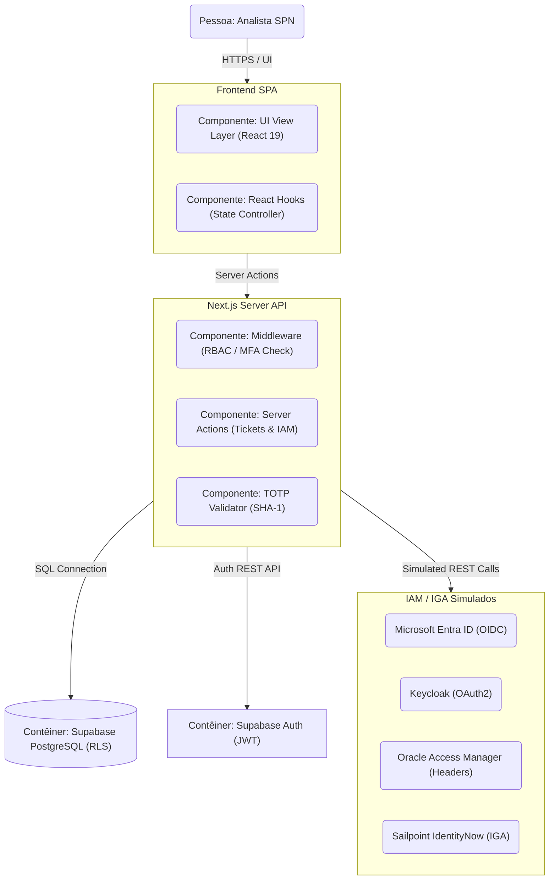

# Documentação Oficial / Official Documentation - CyberITSM SPN

Este documento detalha as especificações técnicas, arquitetura multicamadas, controle de autenticação e governança, integrações com provedores de IAM e o roteiro de implantação do sistema **CyberITSM SPN** reconstruído em **Next.js**.

---

## 🇧🇷 Português - Especificação Técnica

### 1. Visão Geral do Sistema
O **CyberITSM SPN** é uma plataforma corporativa de gerenciamento de chamados especializada em **Arquitetura e Conformidade de Cibersegurança**. Ela implementa um fluxo visual Kanban inspirado no Jira da Atlassian, permitindo que analistas correlacionem cada ticket com controles regulatórios internacionais (NIST CSF, CIS Controls, ISO/IEC 27001 e SABSA) de forma auditável e segura, usando a identidade visual **Mistica da Telefônica**.

### 2. Arquitetura Consolidada (Detailed C4 Containers & Components)
A solução adota um design moderno baseado em Next.js App Router no frontend/backend e Supabase como provedor de dados/autenticação:

#### A. Camada de Frontend (SPA)
- **UI View Layer (React 19 / Tailwind CSS v4)**: Utiliza a marca oficial **Telefônica Mistica** (cores roxas `#660099`, laranja Vivo `#FF9900` e tipografia Outfit do Google Fonts) para renderizar a tela de login, o console do Kanban, logs de auditoria e os formulários de acesso.
- **State Controller (React Hooks)**: Controla o estado em tempo de execução no cliente, gerencia a lógica de drag-and-drop de chamados SPN e manipula os estados de abas no painel de controle.
- **Agente SecOps de Inteligência Artificial**: Uma interface de Chat nativa injetada como FAB (Floating Action Button), provendo interações de conformidade instantâneas com mapeamento de frameworks (NIST, CIS, ISO 27001, SABSA, LGPD e PCI-DSS).

#### B. Camada de Backend (Vercel Serverless / Server Actions)
- **Next.js Middleware**: Roda na Edge da Vercel. Intercepta requisições ao `/dashboard/*` para garantir que o usuário está logado, possui MFA verificado (através do cookie seguro `mfa_verified`) e se o perfil RBAC atende a rotas administrativas (`/architecture`).
- **Server Actions & API Routes**: Expõe ações tipadas de leitura e escrita (`app/actions/tickets.ts`, `app/actions/auth.ts`, `app/actions/iam.ts`), aplicando as regras de auditoria e controle. O endpoint de API (`app/api/chat/route.ts`) gerencia as requisições conversacionais da inteligência artificial SecOps.
- **TOTP Validator (`lib/totp.ts`)**: Validador de algoritmos de senhas temporárias de 6 dígitos baseado em RFC 6238, utilizando o Web Crypto API nativo para HMAC-SHA1.

#### C. Camada de Dados & Segurança (Supabase)
- **Supabase PostgreSQL**: Banco relacional na nuvem com Row Level Security (RLS) ativo para garantir isolamento de chamados, comentários e registros.
- **Supabase Auth**: Gerenciamento de credenciais e sessões de usuários via tokens JWT.

---

### 3. Autenticação, MFA & Jornada de Identidade
O CyberITSM SPN possui uma jornada completa de autenticação local e segurança baseada na tabela `users_profiles`:
- **Login & Credenciais**: Usuários autenticam-se com e-mail corporativo e senha criptografada gerenciados pelo Supabase Auth.
- **Autenticação Multi-Fator (MFA/TOTP)**: O middleware e o painel de login validam se o MFA está configurado. No primeiro acesso, o usuário passa por onboarding (geração de chave Base32 e QR Code visual). O acesso ao dashboard exige a digitação correta do código de 6 dígitos. Código de homologação para testes: `123456`.
- **Esqueci minha senha & Recuperação**: O fluxo gera um token único de redefinição de senha (`reset_token`) com expiração de 1 hora. O sistema exibe um banner com o link `/reset-password?token=XYZ` no ambiente sandbox.
- **Alteração de Senha**: O painel de segurança valida o novo password contra políticas corporativas de complexidade (mínimo 12 caracteres, letras maiúsculas/minúsculas, números e caracteres especiais).

---

### 4. Integração com Microsserviços IAM / IGA
O CyberITSM SPN possui adaptadores nativos para gerenciar identidades a partir de quatro grandes provedores de mercado:
- **Microsoft Entra ID**: Importa identidades simuladas com base em escopos OIDC e grupos corporativos.
- **Keycloak Broker**: Mapeia Realms e simula credenciais de Client ID/Client Secret em servidores centralizados.
- **Oracle Access Manager (OAM)**: Integração via emulação de injeção de cabeçalhos de rede HTTP baseada em Gateways legados.
- **Sailpoint IdentityNow (IGA)**: Módulo de governança formal que exige criação de requisição (Identity Request), workflow de aprovação por gestor SecOps e provisionamento automático pós-autorização (atualizando a função do usuário na tabela `users_profiles`).
- **Criação Manual (Local)**: Permite ao administrador registrar colaboradores locais diretamente no banco de dados com perfil RBAC específico.

---

### 5. Suite de Segurança & Qualidade
- **Static Typecheck**: `npx tsc --noEmit` valida a integridade de todas as tipagens das interfaces de dados.
- **Production Build**: Compilação Next.js para otimização de bundle e validação de rotas SSR antes da publicação.
- **Audit Logs**: Registra todas as ações administrativas, como login com sucesso, alterações de MFA, criação de chamados e sincronizações de IAM.

---

## 🇺🇸 English - Technical Specification

### 1. System Overview
**CyberITSM SPN** is an enterprise ticket management platform specialized in **Cybersecurity Architecture and Compliance**. It implements an Atlassian Jira-inspired visual Kanban board workflow, allowing architects and SecOps analysts to correlate every action with international compliance standards (NIST CSF, CIS Controls, ISO/IEC 27001, and SABSA) in an auditable and secure environment, utilizing **Telefonica's Mistica** design system.

### 2. Consolidated Architecture (Detailed C4 Containers & Components)
The application adopts a consolidated serverless architecture with Next.js App Router for frontend UI and backend API routes/Server Actions, utilizing Supabase as the data persistence and authentication service:

#### A. Frontend Layer (SPA)
- **UI View Layer (React 19 / Tailwind CSS v4)**: Employs **Telefonica's Mistica** design system tokens (Vivo purple palette `#660099`, orange warning color `#FF9900`, and Google Fonts Outfit typography) to render pages and panels.
- **State Controller (React Hooks)**: Manages client-side runtime states, including tab switching, drag-and-drop operations, and modal overlays.

#### B. Backend Layer (Next.js Server Actions)
- **Security Middleware**: Runs on Vercel Edge. Guards `/dashboard/*` paths, checking session validity, MFA confirmation (via the `mfa_verified` cookie), and RBAC profile roles.
- **Server Actions**: Exposes typed database controllers for tickets, audit logs, IAM synchronizations, and credential management.
- **TOTP Validator**: A RFC 6238 time-based token validator utilizing Web Crypto API.

#### C. Database & Security Layer (Supabase)
- **Supabase PostgreSQL**: Managed PostgreSQL database with strict Row Level Security (RLS) policies.
- **Supabase Auth**: Handles secure user registration, session management, and JWT claims.

---

### 3. Authentication, MFA & Identity Journey
- **Login & Credentials**: Users authenticate using their corporate email and secure password.
- **Multi-Factor Authentication (MFA/TOTP)**: On first login, onboarding interface renders key setup and QR code. Subsequent logins demand a 6-digit OTP check. Master code for testing: `123456`.
- **Forgot Password Recovery**: Generates a secure `reset_token` valid for 1 hour, displaying a sandbox recovery link.
- **Password Strength Policy**: Enforces strong credentials (12+ characters, upper/lowercase, number, special character) during resets.

---

### 4. Identity & Access Governance Integrations (IAM / IGA)
- **Microsoft Entra ID**: Cloud OIDC client simulating imports based on scopes and claims.
- **Keycloak Broker**: OIDC Realm mapping client credentials and local RBAC translations.
- **Oracle Access Manager (OAM)**: WebGate emulation extracting identity properties from HTTP headers.
- **Sailpoint IdentityNow (IGA)**: Triggers access requests, records approval workflows by SecOps managers, and provisions identities locally upon authorization.

---

### 5. Deployment Architecture (Vercel CDN + Edge)
- **Edge Deployment**: Next.js App Router is compiled and deployed globally to Vercel's serverless infrastructure.
- **CI/CD Integration**: Automatic build and release triggers on push to the `main` branch on GitHub.
